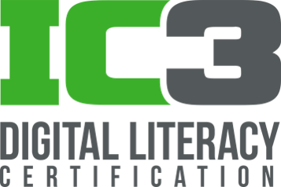

# Computer and Information Technology Skills 
09000001 ทักษะการใช้คอมพิวเตอร์และเทคโนโลยีสารสนเทศ

ผู้สอน: ดร.รัฐพรหม พรหมคำ/ อ.อัคเรศ สิงห์ทา



## ปีการศึกษา 2564/1
รายวิชานี้ดำเนินการสอนในรูปแบบห้องเรียนออนไลน์หรือเป็นไปตามประกาศ
ของทางมหาวิทยาลัยเทคโนโลยีราชมงคลธัญบุรี ขอให้นักศึกษาดำเนินการ
**เข้าร่วมห้องเรียนออนไลน์บนระบบ Microsoft Teams** โดยใช้ลิงค์ (Link) หรือรหัสการเข้าร่วม (Invitaion Code) ตามกลุ่มเรียนต่อไปนี้
**ภายในวันที่ 4 กรกฎาคม 2564 เวลา 16.00**

| Section | Invitation Code |Link | 
|---------|------|-----------------|
| Sec 40 | `3u375gh` | [Join Classroom](https://teams.microsoft.com/l/team/19%3afAjzkKnL6llItZQa_JYN7UmZJyaGevbyLNFq1S1Sh841%40thread.tacv2/conversations?groupId=96d66d72-915d-4153-ac49-a88a2825c342&tenantId=0ace20bb-9275-4172-b6f2-52b66dba0f4d)| 
| Sec 42 | `yqyuf6h` | [Join Classroom](https://teams.microsoft.com/l/team/19%3a44VRyddrp4VgbhmXdKNhGqLFev7evzGkHnMOWZ-iJ3s1%40thread.tacv2/conversations?groupId=fbd30072-cd45-4ca0-8893-fa3d75550491&tenantId=0ace20bb-9275-4172-b6f2-52b66dba0f4d)| 

ในกรณีที่นักศึกษาใช้รหัสการเข้าร่วม นักศึกษาสามารถเข้าใช้ห้องเรียนออนไลน์ได้ทันที แต่ถ้าใช้ลิงค์นักศึกษาต้องรอผู้สอนอนุมัติการเข้าร่วมอีกครั้ง 
ภายในวันที่ 5 กรกฎาคม 2564 เวลา 09.00

## เวลาเรียน

| Section | วัน-เวลา | หมายเหตุ | 
|---------|--------|---|
|Sec 40 | วันพฤหัสบดี 08.00 - 12.00 | ทฤษฎี 2 ชั่วโมง/ปฏิบัติ 2 ชั่วโมง|
|Sec 42 | วันพฤหัสบดี 13.00 - 17.00 | ทฤษฎี 2 ชั่วโมง/ปฏิบัติ 2 ชั่วโมง|


## คำอธิบายรายวิชา
ความรู้พื้นฐานการใช้คอมพิวเตอร์การใช้โปรแกรมสำนักงาน ได้แก่ โปรแกรมประมวลผลคำ การใช้โปรแกรมตารางคำนวณ การใช้โปรแกรมนำเสนอ การใช้อินเทอร์เน็ตและการสื่อสารสังคมออนไลน์ ได้แก่ เครือข่ายคอมพิวเตอร์ เทคโนโลยีการสื่อสารข้อมูล จดหมายอิเล็กทรอนิกส์แบบภายในและภายนอกองค์กร การท่องเครือข่ายอินเทอร์เน็ต และความรู้ทั่วไปเกี่ยวกับโลกออนไลน์

Computing fundamentals, key applications such as Word Processor (Microsoft Word), Spreadsheets (Microsoft Excel), Presentation (Microsoft PowerPoint), Internet and social networks such as computer network, communication technology, internal and external e-mail correspondence, surfing the Internet, and general knowledge about the Internet World


## จุดมุ่งหมายรายวิชา
1. เพื่อให้ผู้เรียนมีความรู้ความเข้าใจความรู้พื้นฐานการใช้คอมพิวเตอร์ การใช้โปรแกรมสำนักงานการใช้งานอินเตอร์เน็ต รวมถึงการรู้เท่าทันสารสนเทศสื่อออนไลน์
2. เพื่อให้ผู้เรียนมีทักษะการใช้คอมพิวเตอร์การใช้โปรแกรมสำนักงาน การใช้งานอินเตอร์เน็ต และการสื่อสารออนไลน์
3. เพื่อให้ผู้เรียนประยุกต์ใช้ความรู้พื้นฐานการใช้งานคอมพิวเตอร์การใช้งานโปรแกรมสำนักงาน การใช้งานอินเตอร์เน็ตรวมถึงการรู้เท่าทันสารสนเทศสื่อออนไลน์มาประยุกต์กับการใช้งานในชีวิตประจำวัน
4. เพื่อเพิ่มศักยภาพผู้เรียนใช้และรู้จักใช้เทคโนโลยีสารสนเทศได้อย่างเหมาะสมมีความสามารถวิเคราะห์เชิงตัวเลขและการจัดการข้อมูล

## หัวข้อการบรรยาย

นักศึกษาสามารถรับฟังการบรรยาย สนทนา และซักถาม
ผ่านระบบ Microsoft Teams ตามวันและเวลาของกลุ่มเรียนข้างต้น 
ทั้งนี้นักศึกษาสามารถใช้ระบบ [e-Training](https://ic3.rmutt.ac.th)
ในการทบทวนและเตรียมความพร้อมได้ตลอดเวลา
โดยหัวข้อการบรรยายในรายวิชานี้ทั้งหมดประกอบไปด้วย:

| หน่วยที่ | หัวข้อ | IC3  | เอกสารประกอบ |
| ----- |-----|------|-------------|
|  | แนะนำรายวิชา และเรียนรู้การใช้เครื่องมือ/ระบบ | - | [Download](./materials/intro.pdf) |
| 1 | การทำงานของคอมพิวเตอร์  | Module 1 | [Download](./materials/unit_1.pdf)  |
| 2 | การเข้าถึงสื่อดิจิทัล | Module 1 | [Download](./materials/unit_2.pdf) |
| 3 | การสื่อสารออนไลน์ | Module 3 | [Download](./materials/unit_3.pdf) |
| 4 |การรู้เท่าทันสื่อดิจิทัล และความปลอดภัยบนโลกดิจิทัล | Module 3 | [Download](./materials/unit_4.pdf) |
| 5 |การสร้างสื่อดิจิทัล: Microsoft Word | Module 2 | [Office 365 - Word](./materials/word_365.pdf) และ [Workshops](./materials/word_365_lab.pdf) |
| 5 |การสร้างสื่อดิจิทัล: Microsoft Excel | Module 2 |  |
| 5 |การสร้างสื่อดิจิทัล: Microsoft PowerPoint | Module 2 |  |

ทุกหัวข้อการสร้างสื่อดิจิทัลจะปฏิบัติการบนระบบคลาวด์ [Office 365](https://www.office.com) ซึ่งจำเป็นต้องมีการเชื่อมต่อกับเครือข่ายอินเตอร์เน็ตตลอดเวลาปฏิบัติการ

## วีดีโอออนไลน์สำหรับทบทวนบทเรียน

1. [IC3 Module 1: Computing Fundamental](https://www.youtube.com/playlist?list=PL6s54_j3o0zHpUyLru6N8VFgy3Xj4lsul) (กลางภาค: ครอบคุลมเนื้อหาในส่วน [หน่วยที่ 1](./materials/unit_1.pdf) และ [หน่วยที่ 2](./materials/unit_2.pdf) แนะนำให้ศึกษาจากเอกสารประกอบการบรรยายด้วย)
2. [IC3 Module 3: Living Online](https://www.youtube.com/playlist?list=PL6s54_j3o0zE7t6zCMUNEpclvcUsRNFdI) (กลางภาค: ครอบคุลมเนื้อหาในส่วน [หน่วยที่ 2](./materials/unit_2.pdf), [หน่วยที่ 3](./materials/unit_3.pdf) และ [หน่วยที่ 4](./materials/unit_4.pdf) แนะนำให้ศึกษาจากเอกสารประกอบการบรรยายด้วย)
3. [IC3 Module 2: Key Applications]() (ปลายภาค)

## การสอบวัดผล

1. ติดตามจาก [ประกาศกำหนดการสอบย่อยครั้งที่ 1](./exam_mid/)
2. ติดตามจาก [ประกาศกำหนดการสอบกลางภาค](./exam_mid/)
3. ติดตามจาก [ประกาศกำหนดการสอบย่อยครั้งที่ 2](./) (ยังไม่ประกาศ)
4. ติดตามจาก [ประกาศกำหนดการสอบปลายภาคภาค](./) (ยังไม่ประกาศ)

## การวัดผลการเรียน
คะแนนเต็ม 100 คะแนน โดยแบ่งออกเป็น
- การสอบกลางภาค 30%
- การสอบปลายภาค 30%
- การสอบก่อนกลางภาค 10%
- การสอบหลังกลางภาค 10%
- งานที่ได้รับมอบหมาย 15%
- จิตพิสัย 5%

หากนักศึกษาเข้าเรียนน้อยกว่า 80% ของเวลาเรียนทั้งหมด
หรือได้คะแนนรวมน้อยกว่า 50% ของคะแนนเต็ม นักศึกษาจะไม่ผ่านในรายวิชานี้ และได้รับการบันทึกผลการเรียน F (เกรด 0.0) 

สำหรับนักศึกษาที่ผ่านเกณฑ์ดังกล่าว จะได้รับการบันทึกผลการเรียนตามเกณฑ์ของคะแนน t-score 

```
t-score = 50 + 10*(x - u)/s
```
เมื่อ x คือคะแนนรวม, u คือคะแนนเฉลี่ยของคะแนนรวม และ s คือส่วนเบี่ยงเบนมาตรฐานของคะแนนรวม

ดังนี้

| ผลการเรียน | เกรด | เกณฑ์ t-score |
|---------|------|--------------|
| D | 1.00 | [50, 55) | 
| D+ | 1.50 | [55, 60) | 
| C | 2.00 | [60, 65) |
| C+ | 2.50 | [65, 70) |
| B | 3.00 | [70, 75) |
| B+ | 3.50 | [75, 80) |
| A | 4.00 | [80, Inf) |


## เอกสารอ้างอิง
- ครรชิต มาลัยวงศ์ และโกสันต์ เทพสิทธิทรากรณ์.  พื้นฐานความรู้ทางคอมพิวเตอร์.  กรุงเทพฯ : ชวนพิมพ์,  2542.
- ธงชัย สิทธิกรณ์.  ทฤษฎีระบบคอมพิวเตอร์.  พิมพ์ครั้งที่ 2. กรุงเทพฯ : สยามสปอร์ต ซินดิเคท, 2542.
- นฤชิต แววศรีผอง และรุ่งทิวา ศิรินารารัตน์.  คอมพิวเตอร์เบื้องต้น (เล่ม1). กรุงเทพฯ : ซีเอ็ดยูเคชั่น,  2542.
- นฤชิต แววศรีผอง และรุ่งทิวา ศิรินารารัตน์.  คอมพิวเตอร์เบื้องต้น (เล่ม5). กรุงเทพฯ : ซีเอ็ดยูเคชั่น,  2543.
- ลอง, ลารี่. เทคโนโลยีคอมพิวเตอร์และสารสนเทศ. กรุงเทพฯ : เพียร์สัน เอ็ดดูเคชั่น อินโดไชน่า, 2543.
- วิเศษศักดิ์ โคตรอาษา. เทคโนโลยีสารสนเทศเพื่อการเรียนรู้.  กรุงเทพฯ :  เธิร์ดเวฟ เอ็ดดูเคชั่น, 2542.